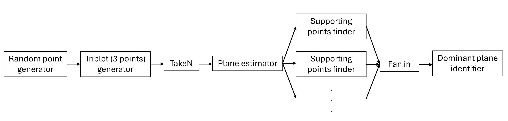
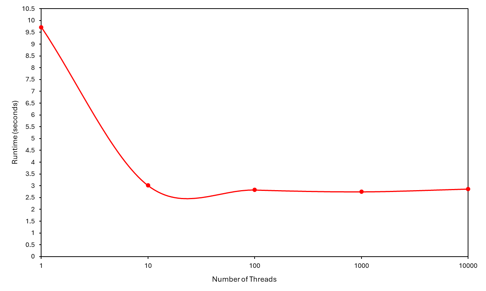
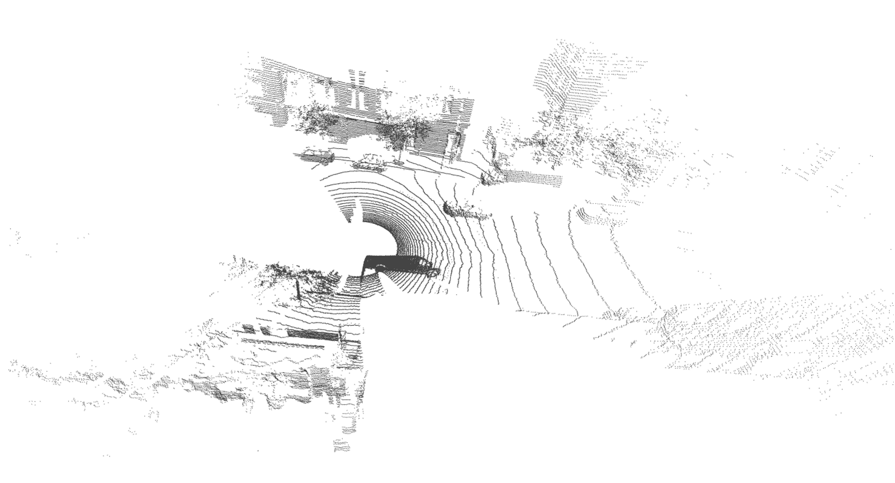
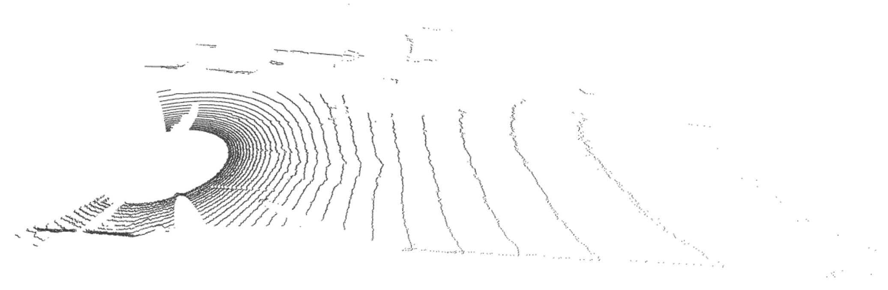
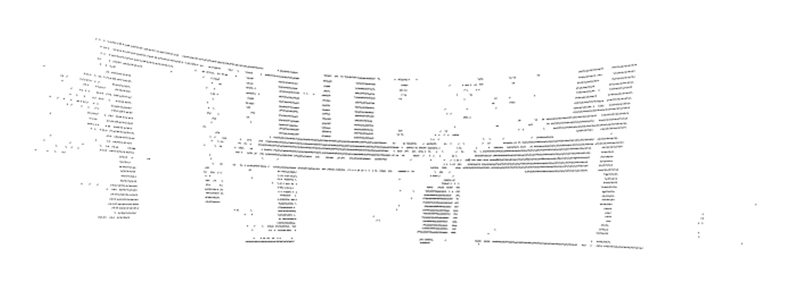

This program finds and saves the three most dominant planes in a point cloud.

It is executed from the command line using: 

`> go run planeRANSAC.go filename confidence percentage eps`

## Architecture and Optimization

This implementation **parallelizes the process of counting the number of points that support a candidate dominant plane** (`SupportingPointFinder()`), which is the most computationally intensive component of the pipeline.

Pipeline schematic

The number of OS threads that can be used by the program is controlled using the `GOMAXPROCS` environment variable from the `runtime` package. Shown below are the results of a thread optimization experiment conducted on a PC. It was carried out using the `PointCloud1.xyz` test file in the repository (confidence of 99% with a percentage of points on the dominant plane equaling 15%, yielding 1,362 iterations).

Runtime vs. number of threads

Unsurprisingly, the lowest runtime occurred when the number of threads were nearly equal to the number of parallel goroutines running in the program (1362); as such, this is the optimal thread count for finding the dominant planes with the previously specified confidence and percentage. The increase in runtime observed when 10,000 threads were used may be due to goroutines being routed to different cores resulting in costly inter-core communication. 

 

## Sample Results

Input LiDAR data containing 80,000 points

Most dominant plane: road, 25,000 points

Second most dominant plane: van, 13,000 points

Third most dominant plane: building wall, 4,300 points
